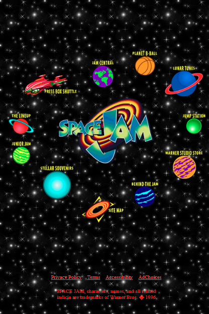

# Space Jam website clone

This assignment will require you to attempt to clone the famous Space Jam website from 1996. Your goal is to closely replicate the design and layout of the site using the provided resources, which include all the necessary images and a full-page screenshot for reference.



## How the site is designed

The site uses a collection of table related elements to lay out the positioning of the images. There are many elements that make up this structure, some of the ones you will be using are listed at the end of this file. An example can also be found just below. 

```html
<table>
    <tbody>
        <tr>
            <td>'actual data or content goes here'</td>
            <td></td>
        </tr>
        <tr>
            <td></td>
            <td></td>
        </tr>
        <tr>
            <td></td>
            <td></td>
        </tr>
    </tbody>
</table>
```

## Table elements to use  

- [center](https://www.w3schools.com/tags/tag_center.asp): It is used to center-align - the content within it horizontally.
- [table](https://www.w3schools.com/tags/tag_table.asp): It represents tabular data and is used to create a table structure.
- [tbody](https://www.w3schools.com/tags/tag_tbody.asp): It groups the body content in a table and is used to define a table body.
- [tr](https://www.w3schools.com/tags/tag_tr.asp): It defines a row in a table.
- [td](https://www.w3schools.com/tags/tag_td.asp): It represents a data cell within a table row.
- [br](https://www.w3schools.com/tags/tag_br.asp): It inserts a line break or a single empty line.

## Other notes

- The site may look like it has a ring of planets but it is really just a table with rows of planets including the image in the center so look at it as a table of rows and not a ring.
- Make sure to also include the links that are placed near the bottom of the page
- The links can all be dead links or link them to a working page like w3, mdn, or your own html page 
- Also look inot how you can create the full background cover only using the small image that was provided.


